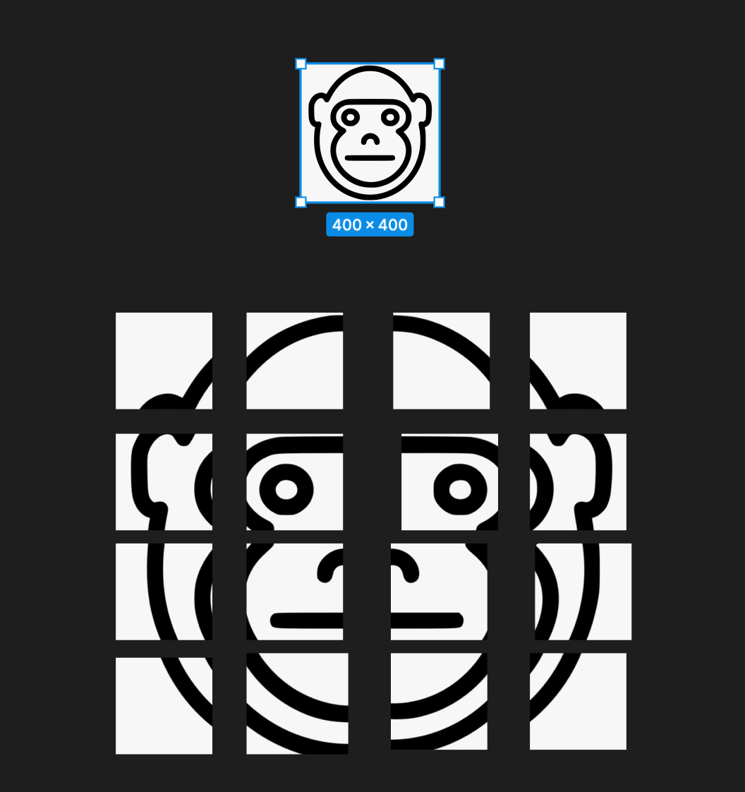

# Fifteen Puzzle 
## A JS game

### Khal's Agenda

- ~~Create  layout of how the images will come together to create the gameboard~~
    
    

- ~~Create the functionality of the game board~~
    - https://youtu.be/iDBP8BOKCDU

    1. ) ~~End-of-game notification:~~
    - ~~Provide some sort of visual notification when the game has been won; that is, when the tiles have been rearranged into their original order. An alert is not sufficient; you should modify the appearance of the page. You may display an image(s) if you like, but there is no way to turn them in, so put them on your web space and use full path URLs when linking to them~~
    - End of video: https://youtu.be/iDBP8BOKCDU (July 16)

     2. ) ~~Create extra animation:~~
    - ~~Create some extra animation congratulating the user or add any other optional behavior to handle this event when the puzzle has been won~~
     - End of video: https://youtu.be/iDBP8BOKCDU (July 16)

     3. ) ~~Create animations:~~
    - ~~Instead of each tile immediately appearing in its new position, make them animate. You can do any sort of animation or other styling you like, as long as the game ends up in the proper state after a reasonable amount of time~~
    - End of video: https://youtu.be/iDBP8BOKCDU (July 16)

    4. ) ~~Game time with some music file:~~
    - ~~Keep track of the game time elapsed in seconds and the total number of moves, and when the puzzle has been solved, display them along with the best time/moves seen so far. The Music files should be a sound to create some adrenalin~~ (July 17)

    5. ) ~~Multiple backgrounds:~~
    - ~~Provide several background images (at least 4) to choose from. The game should choose a random background on startup, and should have a UI (such as a select box) by which the player can choose a different image while playing. Host your additional backgrounds on the web server and link to them using full path URLs~~ (July 18)

- ~~Create UML diagram of how code components work together and add slide containing it~~
    

- ~~Setup and enforce JSlinting as testing & for debugging purposes~~ (July 17)

- ~~Create a powerpoint presenting the the above and project as a whole~~
  - https://docs.google.com/presentation/d/1GsaBDeiai3N08x9iM8HjnDBffVwIXU86SdkM7hMzLP8/edit?usp=sharing (July 17)

- ~~Run / Put W3 validation label~~ (July 20) 

- ~~Create YouTube presentation for the project (using the powerpoint)~~
https://youtu.be/fPASVVXu9y4
(July 20)